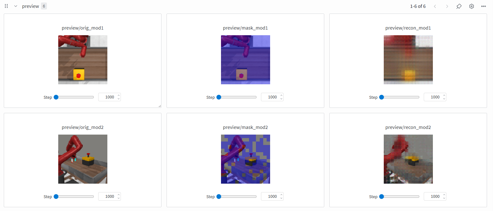
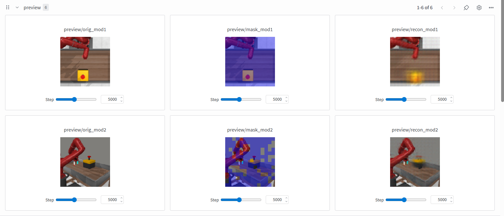
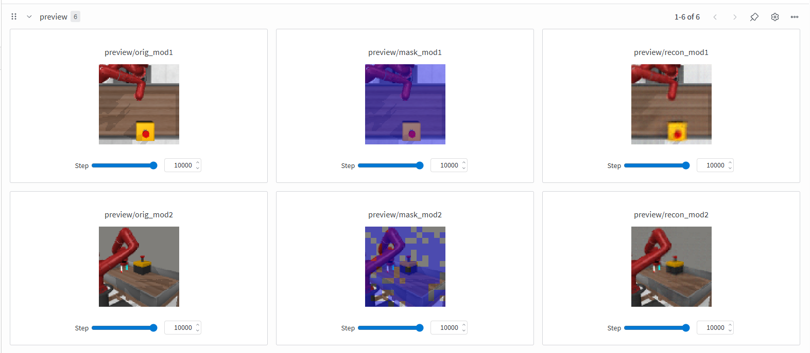
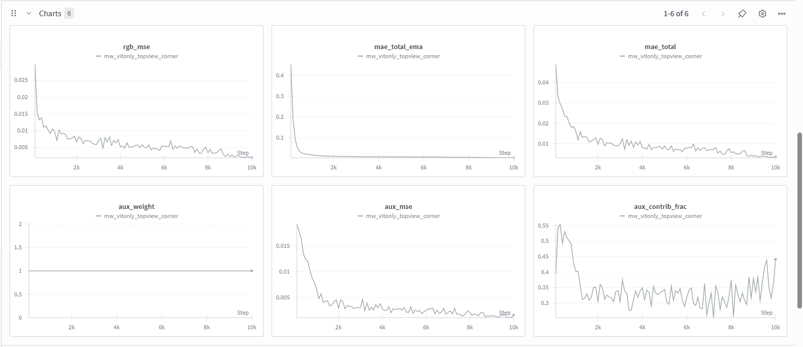

# Multi-modal Vision Transformer Masked Autoencoding

## Overview  
* Two-stream Vision Transformer with a shared 4-layer backbone that jointly encodes synchronized multi-camera views into a shared latent space.

* Uses a Masked Autoencoding (MAE) objective with independent modality masking and learned embeddings for cross-view supervision and pixel-level reconstruction. 
* Pretrained with AdamW + MSE on Meta-World and DeepMind Control, producing transferable visual representations that improve downstream RL policy convergence.

---

### Environment Setup
1. `git clone https://github.com/hamzmu/MultiModalViT.git`  
2. `cd MultiModalViT # if not already`
3. `conda env create -f vsmae_env.yml`  
4. `conda activate multi-vit`  
5. `pretrain_vtmae.py `
6.  Or be specific and control the camera angles, modalitiy masking raito, aux loss weight
`pretrain_vtmae.py --camera_main topview --camera_aux corner --frame_stack 3 
--action_repeat 2 --patch_size 6 --masking_ratio_a 1.0 --masking_ratio_b 0.75 
--aux_loss 1.0 --batch_size 32 --wandb --wandb_project vtmae-only --wandb_run mw_vitonly_topview_corner`

Example output across 1k to 10k timesteps. In this example we are reconstructing the top view of the camera using only 25% of patches from the size view camera. This trains the encoder to develop multi cam understanding in the latent with minimal modality. 

In the images below left images are the input the base cameras setup. second column are the masked(blue) and unmasked patches, where the unmaked patches are passed through the encoder. and the right column in the reconstruction of both camera angles from only the unmasked patches:
## 1k Timesteps
- Early learning, the

## 5k Timesteps

## 10k Timesteps

## Learning Curves 

In theory if you extend this with more camera modalities you are able to have a stronger preception of the environment with a single cam (useful for RL) but have information of multi-camera views (similar to how humans have a multiview understanding of a setting/scene even when we have stereo vision)

Feel free to play around with different making ratio of each modality!

